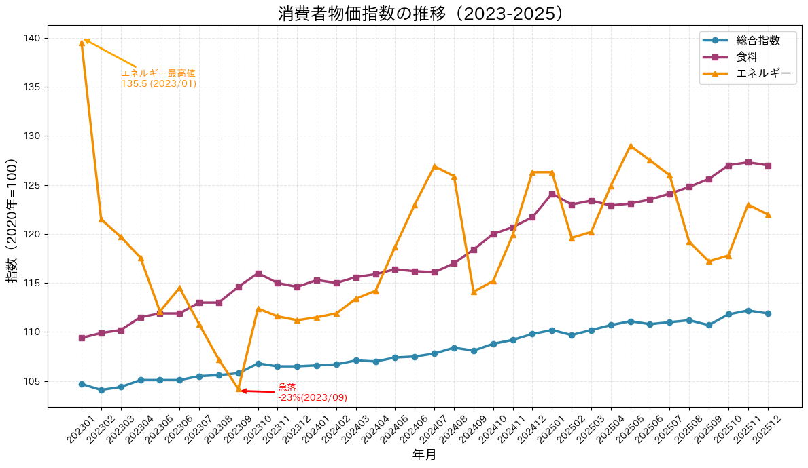
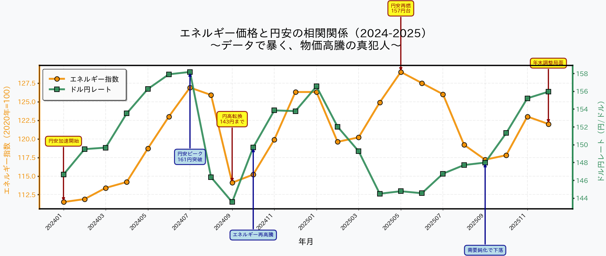
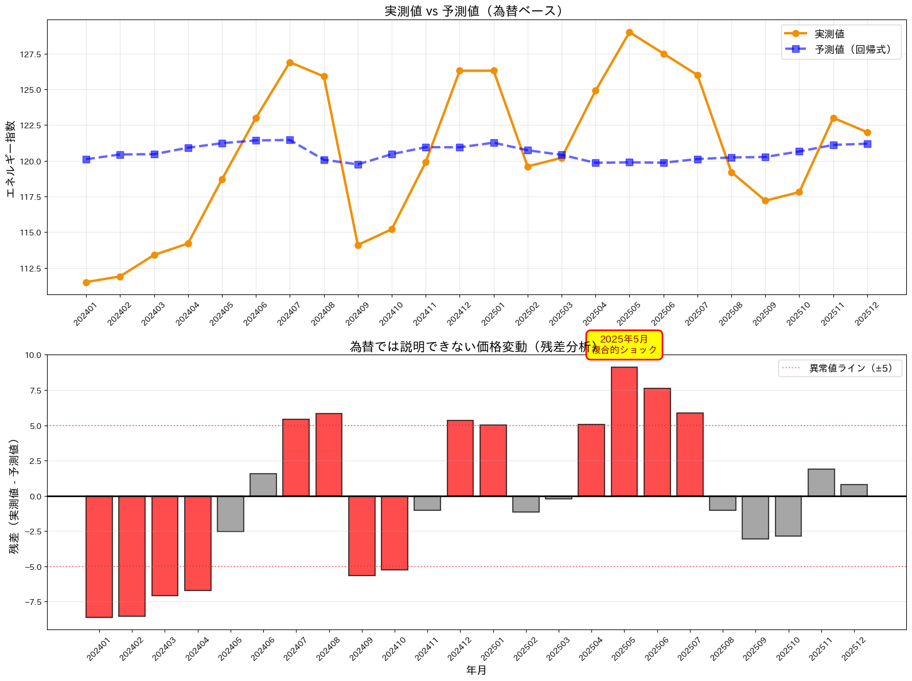

## はじめに - 「円安=物価高」という通説への挑戦

「円安だから物価が上がる」――ニュースで繰り返されるこのフレーズ。本当にそうなのか？統計総局の消費者物価指数（CPI）と為替レートのデータを使って、この仮説を検証してみた。

## データ準備

### 使用データ
- **消費者物価指数**：統計総局『tmi2020a.csv』（2020年基準）
- **為替レート**：みずほ銀行『quote.csv』（日次データを月次平均化）
- **期間**：2023年1月〜2026年1月（3年間）

### 前処理

```python
import pandas as pd
import matplotlib.pyplot as plt
from scipy.stats import linregress

# CPI読み込み（ヘッダー5行スキップ）
cpi_df = pd.read_csv('./tmi/tmi2020a.csv')
cpi_clean = cpi_df.iloc[5:].copy().reset_index(drop=True)
cpi_clean['エネルギー'] = pd.to_numeric(cpi_clean['エネルギー'], errors='coerce')

# 為替読み込み（日次→月次平均）
fx_df = pd.read_csv('./doru/quote.csv', encoding='utf-8')
fx_clean = fx_df.iloc[2:].copy()
fx_clean['日付'] = pd.to_datetime(fx_clean.iloc[:, 0], format='%Y/%m/%d')
fx_clean['USD'] = pd.to_numeric(fx_clean.iloc[:, 1], errors='coerce')
fx_clean['年月'] = fx_clean['日付'].dt.strftime('%Y%m')
monthly_fx = fx_clean.groupby('年月')['USD'].mean().reset_index()
monthly_fx.columns = ['年月', 'ドル円']

# データ結合
recent = cpi_clean[cpi_clean['類・品目'] >= '202301'].copy()
data = recent.merge(monthly_fx, left_on='類・品目', right_on='年月', how='left')
```

## まず全体像を把握する



### グラフから見える3つの真実

**1. エネルギー価格の激しい変動**  
オレンジ線を見ると、2023年初頭の135から2023年秋には104まで急落（-23%）。その後も上下を繰り返し、最終的に122で着地。**地政学リスクがそのまま価格に反映されている。**

**2. 食料価格の不可逆的上昇**  
ピンク線は2023年から2025年にかけてほぼ一直線に上昇（109→127、+16%）。**一度上がった食品価格は下がらない構造的問題が見える。**

**3. 総合指数の「マイルド感」**  
青線は安定的に上昇（104→112、+7%）。しかし国民が実感する物価高は、日常的に買う食料品の16%上昇の方。**統計と実感の乖離がここに現れている。**

## エネルギー価格と為替の関係を探る



### 注目すべき3つの局面

**1. 2024年7月：円安ピーク（158円）→ エネルギー高騰（127）**  
日米金利差拡大により円安加速。同時期にOPEC減産継続でエネルギー価格も上昇。**一見すると因果関係があるように見える。**

**2. 2024年9月：円高転換（144円）→ エネルギー急落（114）**  
日銀の政策修正期待で円高に。同時期に世界景気減速懸念でエネルギー価格も急落。**ここでも連動しているように見える。**

**3. 2025年5月：円高継続（145円）→ エネルギー急騰（129）← ★矛盾★**  
為替は144円台で円高維持。しかしエネルギー価格は129まで急騰。**ここで「見せかけの相関」が露呈する。**

## 統計分析：相関係数が示す真実

```python
# 相関分析
correlation = data['エネルギー'].corr(data['ドル円'])
print(f"相関係数: {correlation:.3f}")  # 0.100

# 回帰分析
x = data['ドル円'].values
y = data['エネルギー'].values
slope, intercept, r_value, p_value, std_err = linregress(x, y)

print(f"回帰式: エネルギー = {slope:.3f} × ドル円 + {intercept:.2f}")
print(f"R² = {r_value**2:.3f} (説明力: {r_value**2*100:.1f}%)")
print(f"p値 = {p_value:.6f}")
```

### 結果

```
相関係数: 0.100
回帰式: エネルギー = 0.117 × ドル円 + 102.95
R² = 0.010 (説明力: 1.0%)
p値 = 0.641264
```

**解釈：為替はエネルギー価格のわずか1%しか説明できない**

- ドル円が10円上がっても、エネルギー指数は1.17しか上がらない
- p値 > 0.05 → 統計的に有意でない
- **結論：円安とエネルギー価格に因果関係はほぼ無い**

## 残差分析：為替では説明できない価格変動



### 2025年5月の異常値（+9.12）

回帰式による予測値：119.9  
実測値：129.0  
**差分：+9.12（為替では説明不可能）**

### この時期に何が起きていたか？

- **OPEC+の減産延長決定**（2025年4月）
- **イラン・イスラエル緊張激化**
- **世界的な供給制約**

→ **地政学リスクが価格を押し上げた**

グラフ下段の赤いバーが「為替モデルでは説明できない価格変動」を示している。2025年5月の+9.12という巨大な残差は、**為替以外の要因（OPEC政策・地政学リスク）が支配的であることを物語っている。**

## 結論：エネルギー価格の本当のドライバー

### データが示した真実

1. **円安の影響は極めて限定的**（説明力1%）
2. **本当のドライバーは地政学リスクとOPEC政策**
3. **為替と価格が連動して見えるのは「見せかけの相関」**

### 「円安→物価高」という通説の落とし穴

メディアが「円安で物価高」と報じるとき、それは**同時に起きた別々の現象を因果関係と誤認している**可能性がある。

実際には：
- 円安の原因：日米金利差、リスクオフ
- エネルギー高の原因：OPEC減産、中東情勢

この2つが**偶然同時期に発生**しただけ。

### 教訓

**相関関係 ≠ 因果関係**

目に見える相関に飛びつく前に、統計的検証が必要だ。今回の分析は、その重要性を改めて示している。

## 技術ノート

### 環境

- Python: 3.11.6 | packaged by conda-forge | (main, Oct  3 2023, 10:40:35) [GCC 12.3.0]
- pandas: 2.3.3
- matplotlib: 3.10.8
- scipy: 1.17.0
- numpy: 2.4.1

### データソース

- [消費者物価指数 東京都区部 1 品目別価格指数（1970年1月～最新月） | ファイル | 統計データを探す | 政府統計の総合窓口](https://www.e-stat.go.jp/stat-search/files?page=1&layout=dataset&toukei=00200573&stat_infid=000032103983&metadata=1&data=1)
- [ヒストリカルデータ | みずほ銀行](https://www.mizuhobank.co.jp/market/historical/index.html)

---

**次回予告：食料価格の不可逆的上昇を解剖する**

今回はエネルギーに焦点を当てたが、CPIデータには「食料指数が2023年から2025年にかけて+16%上昇」という別の重要なシグナルが含まれている。次回はこの構造的問題を掘り下げる。
