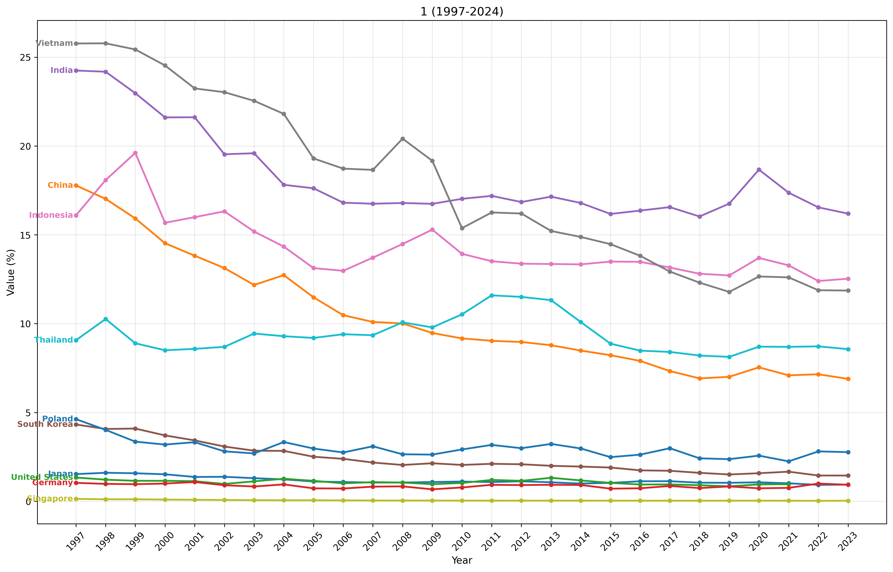
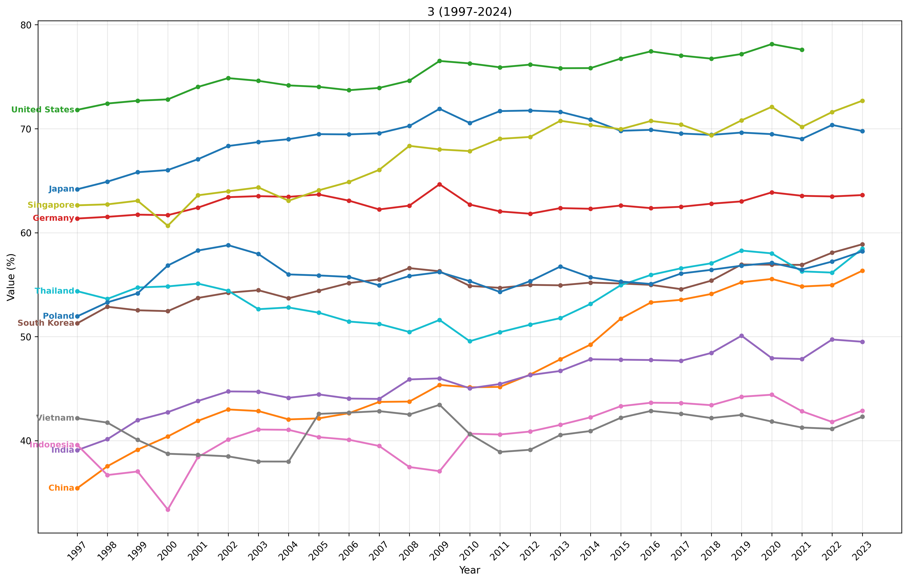

## はじめに

世界の国々の経済は、どのように変化しているのでしょうか？今回は、World Bank（世界銀行）が提供するオープンデータを使って、各国の産業構造の変化を可視化してみました。

この記事では、Pythonの`pandas`と`matplotlib`を使って、1997年から2024年までの約30年間の産業構造の変化をグラフにする方法を紹介します。

## 産業構造とは？

経済学では、産業を3つに分類します：

- **第一次産業**：農業、林業、漁業など（自然から直接資源を得る産業）
- **第二次産業**：製造業、建設業など（原材料を加工する産業）
- **第三次産業**：サービス業、金融、小売など（形のないサービスを提供する産業）

国が経済発展すると、第一次産業から第二次産業へ、そして第三次産業へとシフトしていく傾向があります。これを「産業構造の高度化」と呼びます。

## 使用したデータ

World Bankが提供している以下のデータを使用しました：

- **第一次産業**: [Agriculture, forestry, and fishing, value added (% of GDP)](https://data.worldbank.org/indicator/NV.AGR.TOTL.ZS)
- **第二次産業**: [Industry (including construction), value added (% of GDP)](https://data.worldbank.org/indicator/NV.IND.TOTL.ZS)
- **第三次産業**: [Services, value added (% of GDP)](https://data.worldbank.org/indicator/NV.SRV.TOTL.ZS)

これらは各産業がGDP（国内総生産）に占める割合を示しています。

## 分析対象国

今回は、経済発展段階や地域が異なる10カ国を選びました：

- **日本（JPN）**: 先進国・アジア
- **中国（CHN）**: 新興国・急成長
- **アメリカ（USA）**: 先進国・北米
- **ドイツ（DEU）**: 先進国・欧州
- **インド（IND）**: 新興国・南アジア
- **韓国（KOR）**: 先進国・アジア
- **インドネシア（IDN）**: 新興国・東南アジア
- **ベトナム（VNM）**: 新興国・急成長
- **シンガポール（SGP）**: 先進国・都市国家
- **タイ（THA）**: 新興国・東南アジア
- **ポーランド（POL）**: 中所得国・欧州

## Pythonコード

以下が実際に使用したコードです。
```python
# 第一次: https://data.worldbank.org/indicator/NV.AGR.TOTL.ZS
# 第二次: https://data.worldbank.org/indicator/NV.IND.TOTL.ZS
# 第三次: https://data.worldbank.org/indicator/NV.SRV.TOTL.ZS
# 産業付加価値GDP

import pandas as pd
import matplotlib.pyplot as plt

# CSVデータ取得
df_1 = pd.read_csv('1.csv', skiprows=3)
df_2 = pd.read_csv('2.csv', skiprows=3)
df_3 = pd.read_csv('3.csv', skiprows=3)

# 国名のマッピング
country_names = {
    'JPN': 'Japan',
    'CHN': 'China',
    'USA': 'United States',
    'DEU': 'Germany',
    'IND': 'India',
    'KOR': 'South Korea',
    'IDN': 'Indonesia',
    'VNM': 'Vietnam',
    'SGP': 'Singapore',
    'THA': 'Thailand',
    'POL': 'Poland',
}

def to_chart(df, codes, begin, end, title, filename):
    plt.figure(figsize=(14, 9))
    
    for code in codes:
        data = df[df['Country Code'] == code]
        years = [str(year) for year in range(begin, end)]
        dict_data = data[years].iloc[0].to_dict()
    
        years = list(dict_data.keys())
        values = list(dict_data.values())
        line = plt.plot(years, values, marker='o', linewidth=2, markersize=4)
        
        # 線の最初（スタート地点）に国名ラベルを表示
        plt.text(years[0], values[0], f'{country_names.get(code, code)} ', 
                verticalalignment='center', horizontalalignment='right',
                fontsize=9, color=line[0].get_color(), fontweight='bold')
    
    plt.xlabel('Year', fontsize=11)
    plt.ylabel('Value (%)', fontsize=11)
    plt.title(f'{title} ({begin}-{end})', fontsize=13)
    plt.grid(True, alpha=0.3)
    plt.xticks(rotation=45)
    plt.tight_layout()
    
    # 画像として保存
    plt.savefig(filename, dpi=300, bbox_inches='tight')
    plt.close()

# 3つのグラフを生成
to_chart(df_1, list(country_names.keys()), 1997, 2024, 
         "第一次産業 (Agriculture, forestry, and fishing)", "chart_primary.png")
to_chart(df_2, list(country_names.keys()), 1997, 2024, 
         "第二次産業 (Industry including construction)", "chart_secondary.png")
to_chart(df_3, list(country_names.keys()), 1997, 2024, 
         "第三次産業 (Services)", "chart_tertiary.png")
```

## 分析結果

### 第一次産業（農業・林業・漁業）



**主な傾向：**
- **先進国は1%未満**：日本、アメリカ、ドイツ、シンガポール、韓国などはほぼ横ばいで1%前後
- **新興国は減少傾向**：中国（17% → 7%）、ベトナム（26% → 12%）、インド（24% → 16%）は大きく減少
- **途上国は高め**：インドネシアやタイは約8-13%を維持

これは、経済発展に伴い農業中心から工業・サービス業へとシフトする典型的なパターンです。

### 第二次産業（製造業・建設業）


**主な傾向：**
- **中国の工業化**：約45-47%で高水準を維持（世界の工場としての地位）
- **インドネシアも高水準**：約40-45%で推移
- **先進国は減少傾向**：日本（34% → 29%）、アメリカ（23% → 18%）、ドイツ（28% → 27%）
- **シンガポールの激減**：約32% → 22%（金融・サービス中心へ転換）

興味深いのは、ベトナムやタイなどが約30-35%で安定していることです。これらの国々は製造業を維持しながら発展しています。

### 第三次産業（サービス業）



**主な傾向：**
- **アメリカが最高**：約72-78%とサービス経済の典型
- **先進国は高い**：日本（65% → 70%）、ドイツ（62% → 64%）、シンガポール（64% → 73%）
- **新興国は増加傾向**：中国（35% → 56%）、インド（39% → 49%）、ベトナム（42% → 43%）

全ての国でサービス業の比率が増加または維持されており、「サービス経済化」が世界的なトレンドであることがわかります。

## データから読み取れること

### 1. 経済発展のパターン

経済発展は以下のような段階を経ることが多いです：

1. **農業中心**：第一次産業が主体（途上国）
2. **工業化**：第二次産業が成長（新興国）
3. **サービス経済化**：第三次産業が主体（先進国）

今回のデータでも、この流れが明確に見て取れます。

### 2. 中国の特異性

中国は経済規模が巨大でありながら、第二次産業の比率が約45%と非常に高い状態を維持しています。これは「世界の工場」としての役割を反映しています。

### 3. 先進国の脱工業化

日本、アメリカ、ドイツなどの先進国では、製造業の比率が徐々に低下しています。これは：
- 製造拠点の海外移転
- サービス業（IT、金融、医療など）の成長
- 高付加価値産業へのシフト

といった要因が考えられます。

### 4. 新興国の急速な変化

ベトナムや中国では、わずか20-30年で産業構造が大きく変化しています。これは急速な経済成長と工業化を反映しています。

## World Bankデータの素晴らしさ

今回使用したWorld Bank Open Dataは、データ分析の練習に最適です：

- **標準化されたデータ**：国際比較が容易
- **長期時系列**：数十年分のデータが利用可能
- **無料でオープン**：誰でもダウンロード可能
- **豊富なカテゴリ**：経済、教育、健康、環境など
- **簡単にアクセス**：CSV、Excel、API対応

他にも以下のようなデータソースがあります：
- **OECD.Stat**: 先進国中心の詳細データ
- **IMF Data**: 金融・為替系データ
- **Our World in Data**: 美しい可視化
- **UN Data**: 国連の統計

## まとめ

Pythonとpandasを使えば、世界経済のような大きなテーマでも、簡単にデータを可視化して分析できます。

今回わかったことは：
- 世界的に「サービス経済化」が進んでいる
- 新興国は急速に産業構造を転換している
- 先進国は製造業からサービス業へシフトしている
- 中国は「世界の工場」として高い工業比率を維持

「当たり前」のことでも、実際にデータで確認すると新しい発見があります。World Bankのデータは宝の山なので、ぜひ色々なテーマで分析してみてください！

## 参考リンク

- [World Bank Open Data](https://data.worldbank.org/)
- [pandas公式ドキュメント](https://pandas.pydata.org/docs/)
- [matplotlib公式ドキュメント](https://matplotlib.org/)
