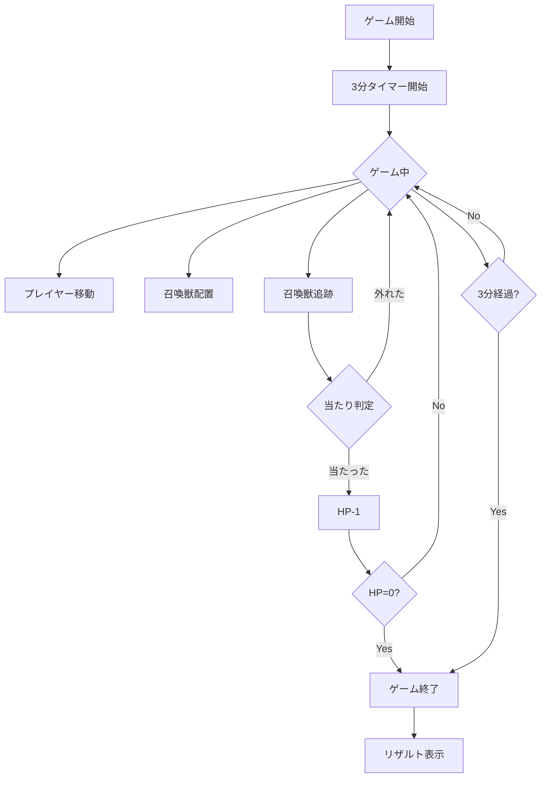
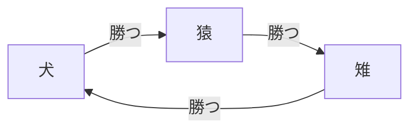
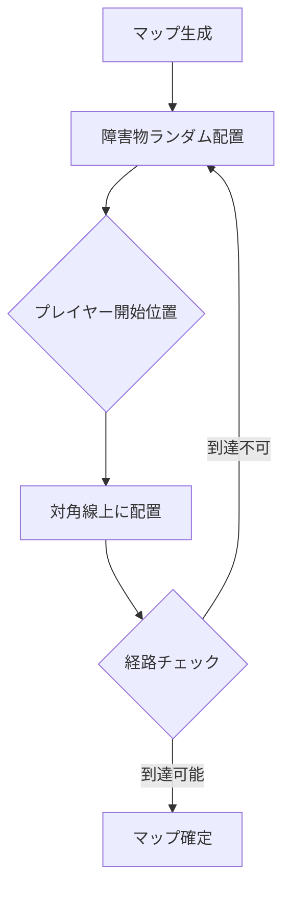
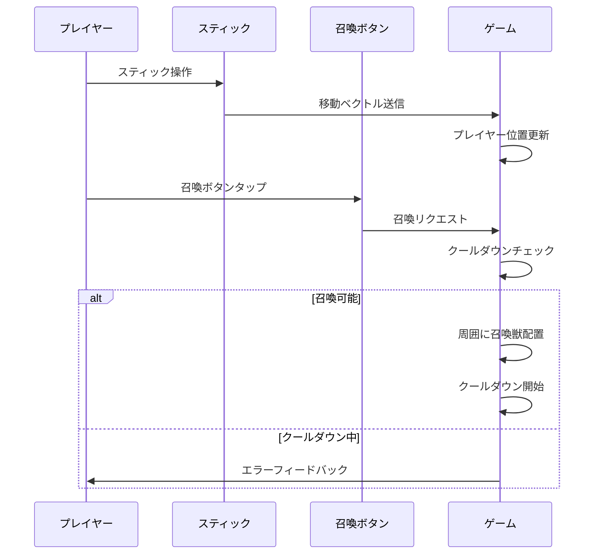
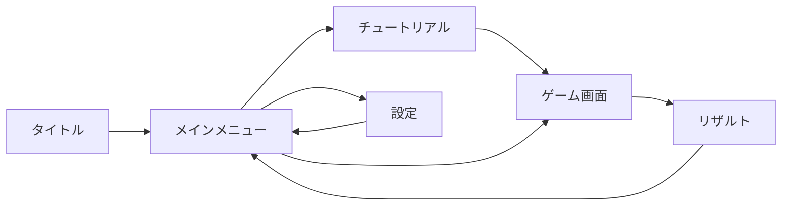
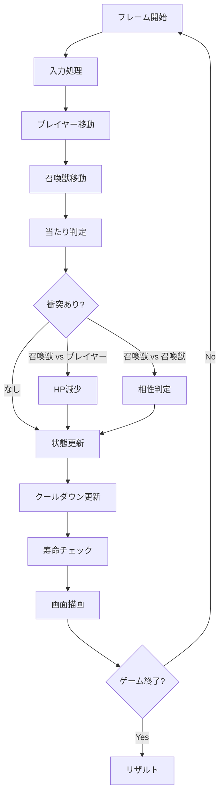
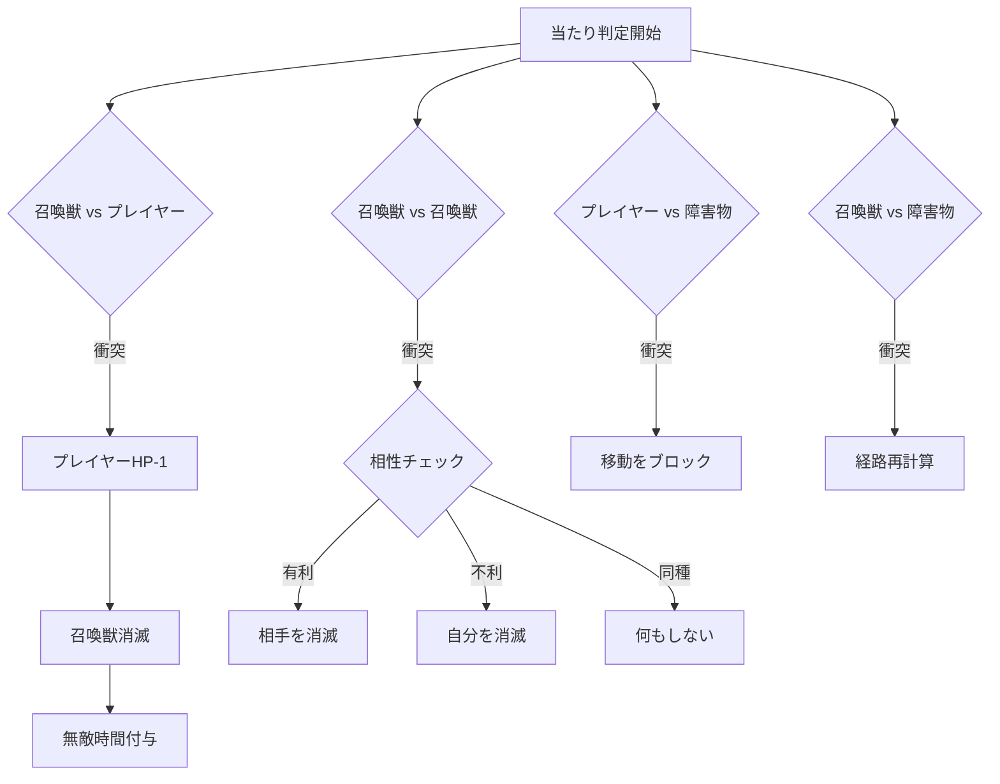
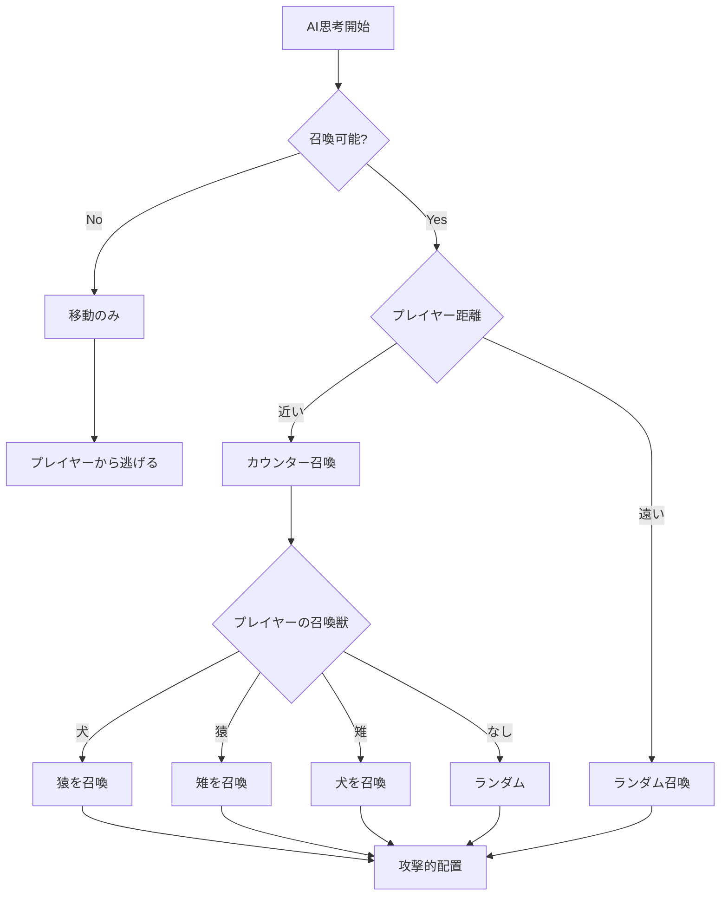
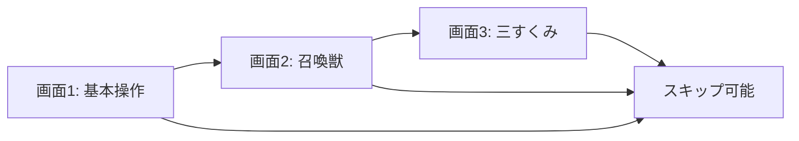
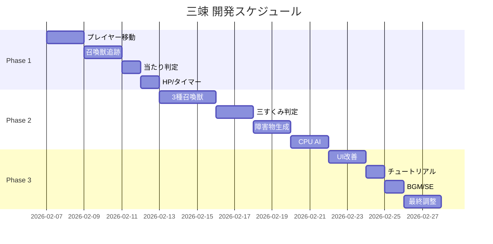

## 1. 概要

### 1.1 ゲームコンセプト
「三竦（さんすくみ）」は、犬・猿・雉の三すくみ関係を利用した追跡型対戦ゲーム。プレイヤーは召喚獣を配置して相手を攻撃しつつ、敵の召喚獣から逃げ切る戦略性とアクション性を兼ね備えたリアルタイムバトルゲーム。

### 1.2 コアメカニクス
- **三すくみ関係**: 犬 → 猿 → 雉 → 犬
- **追跡システム**: 召喚獣は相手プレイヤーを自動追跡
- **相性バトル**: 有利な召喚獣は相手を一方的に倒す
- **戦略的配置**: 召喚位置とタイミングが勝敗を分ける

### 1.3 開発目標
- **シンプル**: ルールが3分で理解できる
- **完成優先**: 1ヶ月以内にプレイアブル版完成
- **Android専用**: Expo使用、まずCPU対戦のみ

---

## 2. ゲーム仕様

### 2.1 基本ルール

#### 勝利条件
- **HP制**: 各プレイヤーHP 3
- **制限時間**: 3分
- **勝敗判定**:
  - 相手のHPを0にした方が勝ち
  - 3分経過時、HP多い方が勝ち
  - 同点の場合は引き分け

#### ゲームフロー


### 2.2 召喚獣仕様

#### 三すくみ関係


#### パラメータ表
| 召喚獣 | 速度 | 寿命 | クールダウン | 特性 |
|--------|------|------|--------------|------|
| 犬 🐕 | 速い | 10秒 | 10秒 | 素早く追跡、短命 |
| 猿 🐒 | 中速 | 10秒 | 10秒 | バランス型 |
| 雉 🐦 | 遅い | 10秒 | 10秒 | 遅いが長持ち |

**共通ルール**:
- 同時召喚数: **合計3体まで**
- 召喚位置: **プレイヤー周囲に自動配置**
- 追跡対象: **相手プレイヤーのみ**
- 相性判定: **有利な相手を一方的に倒す**

#### 相性判定ロジック
```
IF 召喚獣A.type が 召喚獣B.type に有利:
    召喚獣Bを即座に消滅
    召喚獣Aは継続
ELSE IF 召喚獣A.type が 召喚獣B.type に不利:
    召喚獣Aを即座に消滅
    召喚獣Bは継続
ELSE:
    両方継続（同種同士は干渉しない）
```

### 2.3 マップ仕様

#### マップサイズ
- **画面固定**: スクロールなし
- **スマホサイズ対応**: 縦長レイアウト
- **プレイエリア**: 画面上部〜中部（UI除く）

#### 障害物
- **配置**: ランダム生成
- **密度**: 中程度（プレイエリアの20-30%）
- **役割**: 
  - 逃げ道として活用
  - 召喚獣の動きを阻害
  - 戦略的な待ち伏せポイント



---

## 3. 操作仕様

### 3.1 プレイヤー操作

#### 移動
- **方式**: バーチャルスティック（左下）
- **速度**: 召喚獣と同速度
- **ダッシュ**: なし

#### 召喚
- **方式**: ボタンタップのみ
- **配置**: 選択後、プレイヤー周囲に自動配置
- **UI**: 
  - クールダウン残り時間表示
  - 召喚可能/不可の視覚的表示

### 3.2 操作フロー


---

## 4. 画面仕様

### 4.1 画面遷移図


### 4.2 ゲーム画面レイアウト
```
┌─────────────────────────┐
│   HP表示（上部）          │
│   プレイヤー: ❤❤❤       │
│   CPU: ❤❤❤              │
├─────────────────────────┤
│                         │
│                         │
│   ゲームフィールド        │
│   （メインエリア）        │
│                         │
│                         │
│                         │
├─────────────────────────┤
│ [🐕 10s] [🐒 ✓] [🐦 5s] │ ← 召喚ボタン
├─────────────────────────┤
│  🕹️          [⏸]       │ ← スティック & ポーズ
└─────────────────────────┘
```

### 4.3 UI要素詳細

#### HP表示
- 位置: 画面最上部
- 形式: ハートアイコン × 残りHP数
- 色: プレイヤー（青）/ CPU（赤）

#### 召喚ボタン
- 配置: 画面下部、3つ横並び
- 状態表示:
  - **Ready (✓)**: 召喚可能（明るく表示）
  - **Cooldown (Ns)**: 残り秒数表示（暗く表示）
  - **Max召喚数**: 3体出している場合はグレーアウト

#### タイマー
- 位置: 画面上部中央
- 形式: "2:45" のようなカウントダウン
- 警告: 残り30秒で赤色点滅

---

## 5. ゲームフロー

### 5.1 メインループ


### 5.2 当たり判定フロー


### 5.3 CPU AI思考


---

## 6. データ仕様

### 6.1 召喚獣データ構造
```javascript
// 疑似コード（実装言語は別で相談）
SummonData {
  id: string,           // ユニークID
  type: 'dog' | 'monkey' | 'pheasant',
  x: number,            // 座標
  y: number,
  speed: number,        // 移動速度
  lifetime: number,     // 残り寿命（秒）
  target: Player,       // 追跡対象
  owner: Player         // 召喚主
}
```

### 6.2 プレイヤーデータ構造
```javascript
PlayerData {
  x: number,
  y: number,
  hp: number,           // 現在HP（最大3）
  velocity: {x, y},     // 移動ベクトル
  cooldowns: {
    dog: number,        // 残りクールダウン（秒）
    monkey: number,
    pheasant: number
  },
  activeSummons: number // 現在の召喚数
}
```

### 6.3 定数定義
```javascript
CONSTANTS {
  GAME_DURATION: 180,        // 3分
  MAX_HP: 3,
  MAX_SUMMONS: 3,
  COOLDOWN_TIME: 10,
  SUMMON_LIFETIME: 10,
  PLAYER_SPEED: 100,
  
  SPEEDS: {
    dog: 120,     // 速い
    monkey: 100,  // 中速
    pheasant: 80  // 遅い
  },
  
  INVINCIBLE_TIME: 1  // 被弾後の無敵時間（秒）
}
```

---

## 7. 実装優先度

### 7.1 MVP（最小限の実装）
**目標: 1週間**

- [x] プレイヤー移動（スティック操作）
- [x] 召喚獣1種類の追跡動作
- [x] 基本的な当たり判定
- [x] HP管理
- [x] タイマー機能

### 7.2 Phase 2（コア機能）
**目標: 2週間**

- [x] 3種類の召喚獣実装
- [x] 三すくみ判定
- [x] クールダウンシステム
- [x] 障害物生成
- [x] CPU AI（基本）

### 7.3 Phase 3（仕上げ）
**目標: 1週間**

- [x] UI/UX改善
- [x] チュートリアル（1-3画面）
- [x] リザルト画面
- [x] 設定画面
- [x] BGM/SE実装
- [x] グラフィック調整

### 7.4 スコープ外（将来対応）
- オンライン対戦
- 追加召喚獣
- ランクマッチ
- リプレイ機能
- マップエディタ

---

## 8. 技術スタック

### 8.1 開発環境
- **フレームワーク**: Expo
- **言語**: TypeScript / JavaScript
- **プラットフォーム**: Android専用

### 8.2 主要ライブラリ（想定）
- `react-native-game-engine`: ゲームループ
- `react-native-joystick`: バーチャルスティック
- `matter-js` or 自前実装: 当たり判定

### 8.3 アセット
- **グラフィック**: シンプルな図形（◯、△、□）
- **BGM**: フリー素材
- **SE**: フリー素材 or 自作

---

## 8.5 アーキテクチャ設計指針

### 8.5.1 テスタブルな設計原則

**目的**: ゲームロジックとUIを分離し、Jestで確実にテストできる設計にする

#### 責務分離

以下のように責務を分けてください：
- **Model層**: ゲーム状態とロジック（クラスで実装、Reactに依存しない）
- **View層**: UIの描画のみ（Reactコンポーネント）
- **Controller/Hook層**: ModelとViewの橋渡し（カスタムフック）

Modelは完全に独立してテスト可能にする。

#### 実装手順（TDD）

1. まずゲームロジックのインターフェース（型定義）を設計
2. そのロジックのテストケースを先に書く
3. ロジックを実装（テストがパスするまで）
4. 最後にReactコンポーネントでUIを作成

#### Model層の制約

ロジッククラスは以下を満たす：
- **外部依存なし**（乱数、時刻、ストレージ等は引数で受け取る）
- **副作用は明示的**なメソッド呼び出しのみ
- **状態変更は戻り値かイベント**で通知（直接DOMやReact stateを触らない）
- `import React`や`import { View } from 'react-native'`を含まない

#### ファイル構成
```
app/
├── models/          # ビジネスロジック（純粋TypeScript）
│   ├── GameEngine.ts
│   ├── Player.ts
│   ├── Summon.ts
│   ├── CollisionDetector.ts
│   └── __tests__/   # Jestユニットテスト
│       ├── GameEngine.test.ts
│       ├── Player.test.ts
│       └── Summon.test.ts
├── hooks/           # React統合層
│   ├── useGameEngine.ts
│   └── useGameLoop.ts
└── screens/         # UIコンポーネント
    ├── GameScreen.tsx
    ├── TutorialScreen.tsx
    └── ResultScreen.tsx
```

#### 実装例

❌ **悪い例（ロジックとUIが密結合）**:
```tsx
export default function GameScreen() {
  const [playerHP, setPlayerHP] = useState(3);
  const [summons, setSummons] = useState([]);
  
  const spawnSummon = (type) => {
    if (summons.length >= 3) return;
    setSummons([...summons, { type, x: playerX, y: playerY }]);
  };
  // ↑ テスト不可能
}
```

✅ **良い例（ロジック分離）**:
```tsx
// models/GameEngine.ts (テスト可能)
export class GameEngine {
  constructor(
    private state: GameState,
    private randomGen: () => number = Math.random
  ) {}
  
  spawnSummon(type: SummonType, x: number, y: number): void {
    if (this.state.summons.length >= MAX_SUMMONS) {
      throw new Error('Max summons reached');
    }
    this.state.summons.push(new Summon(type, x, y));
  }
  
  getState(): Readonly<GameState> {
    return { ...this.state };
  }
}

// screens/GameScreen.tsx (UIのみ)
export default function GameScreen() {
  const { engine, state } = useGameEngine();
  
  return (
    <View>
      <Button onPress={() => engine.spawnSummon('dog', x, y)} />
    </View>
  );
}
```

#### ゲームループの扱い

- ゲームループ（`requestAnimationFrame`等）はView層で管理
- Model層は`update(deltaTime: number)`のような純粋関数で状態更新
- タイマーやアニメーションフレームはテスト時にモック可能にする
```tsx
// hooks/useGameLoop.ts
export function useGameLoop(engine: GameEngine) {
  useEffect(() => {
    let lastTime = Date.now();
    const loop = () => {
      const now = Date.now();
      const deltaTime = (now - lastTime) / 1000;
      engine.update(deltaTime);
      lastTime = now;
      requestAnimationFrame(loop);
    };
    const id = requestAnimationFrame(loop);
    return () => cancelAnimationFrame(id);
  }, [engine]);
}
```

#### 乱数・副作用の扱い

- `Math.random()`は直接使わず、コンストラクタで乱数生成器を注入
- テスト時はシード固定の乱数生成器を使用
- 例: `constructor(private rng: () => number = Math.random)`
```typescript
// テストコード例
describe('GameEngine', () => {
  test('障害物がランダムに生成される', () => {
    let seed = 0;
    const mockRandom = () => {
      seed = (seed + 1) % 10;
      return seed / 10;
    };
    
    const engine = new GameEngine({ ... }, mockRandom);
    engine.generateObstacles();
    
    // 決定論的にテスト可能
    expect(engine.getState().obstacles.length).toBe(5);
  });
});
```

## 9. チュートリアル仕様

### 9.1 画面構成


### 9.2 内容
**画面1: 基本操作**
- スティックで移動
- ボタンで召喚
- 目標: 相手のHPを0にする

**画面2: 召喚獣**
- 3種類の召喚獣
- クールダウン10秒
- 最大3体まで

**画面3: 三すくみ**
- 犬 → 猿 → 雉 → 犬
- 有利な相手を倒せる
- 戦略的に使い分けよう

---

## 10. リザルト画面

### 10.1 表示内容
- **勝敗**: WIN / LOSE / DRAW
- **最終HP**: プレイヤー vs CPU
- **プレイ時間**: 実際の経過時間
- **召喚回数**: 各召喚獣の使用回数

### 10.2 ボタン
- **もう一度**: ゲーム画面に戻る
- **メニュー**: タイトルに戻る

---

## 11. 設定画面

### 11.1 設定項目
- **BGM音量**: スライダー（0-100%）
- **SE音量**: スライダー（0-100%）
- **難易度**: 固定（将来拡張用）

---

## 12. 開発スケジュール



---

## 13. 補足事項

### 13.1 デザイン方針
- **シンプル第一**: 複雑な機能は後回し
- **完成優先**: 拡張性より動作保証
- **自分が楽しい**: 他人の評価は二の次

### 13.2 今後の拡張案（メモ）
- ターン制モード（別ゲームとして）
- 召喚獣の特殊能力
- マルチプレイヤー
- ランキング機能

### 13.3 既知の課題
- 障害物の最適配置アルゴリズム
- CPU AIの賢さ調整
- 画面サイズ対応（機種依存）

### 13.4 開発時の注意事項

#### コード生成AIを使用する場合

このプロジェクトではGemini等のAIコード生成を活用する際、**必ずセクション8.5「アーキテクチャ設計指針」に従うこと**。

特に以下を厳守：

- Model層にReactの依存を含めない
- テストファーストで実装する
- 外部依存（乱数、時刻）は注入可能にする

**レビュープロセス**:

1. AIでコード生成
2. Claudeで設計指針に照らしてレビュー
3. 問題があれば修正指示
4. テスト通過を確認してマージ

---

## まとめ

この要件定義書に基づき、シンプルで完成度の高い「三竦（さんすくみ）」を1ヶ月以内に完成させることを目標とする。

**次のアクション**:
1. 技術スタックの詳細検討（別途相談）
2. プロトタイプ作成開始
3. 週次で進捗をブログ記事化
